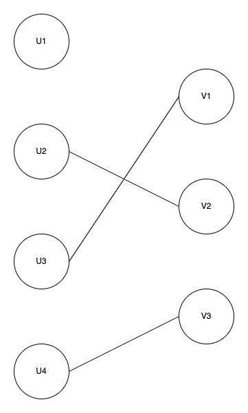
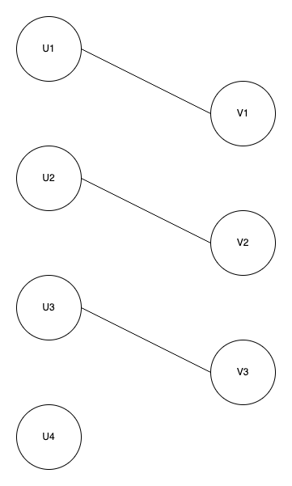

# Matching
[Bipartite graph](https://en.wikipedia.org/wiki/Bipartite_graph) maximum matching algorithm implemented in Java. Treats the problem as a network flow problem and uses 
highly performant [push-relabel maximum flow algorithm](https://en.wikipedia.org/wiki/Push%E2%80%93relabel_maximum_flow_algorithm).

## Quick start

```xml
<dependency>
    <groupId>org.open-structures</groupId>
    <artifactId>matching</artifactId>
    <version>1.0.0</version>
</dependency>
```

Let's say our problem looks like this:


The edge between nodes means that they can be matched. A set of matches where the maximum set of nodes is matched could look like this:



or like this: 



There could be many options.

---

Here's how it can be expressed in code. First we define a 'task qualifications' predicate – a function that returns true when a person can do a task:

    BiPredicate<String, String> matchingPredicate = (u, v) ->
                (u.equals("U1") && v.equals("V1")) ||
                        (u.equals("U2") && (v.equals("V1") || v.equals("V2"))) ||
                        (u.equals("U3") && (v.equals("V1") || v.equals("V3"))) ||
                        (u.equals("U4") && (v.equals("V2") || v.equals("V3")));


Next we create new `Matching` and find a maximum matching:

    Matching<String, String> matching = Matching.newMatching(matchingPredicate, Set.of("U1", "U2", "U3", "U4"), Set.of("V1", "V2", "V3"));
    matching.findMatching();

Now we get our task assignments: 

    Map<String, String> matches = matching.getMatches();
    System.out.print(matches); // could print {U1=V1, U2=V2, U3=V3} or any other of maxumim matches


 
