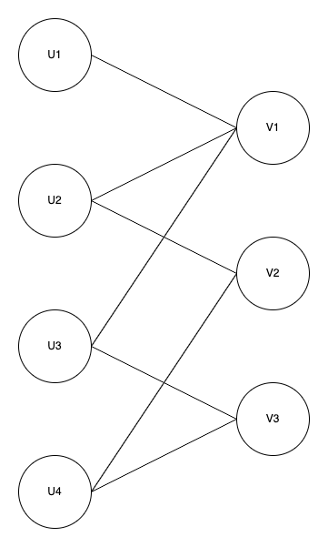
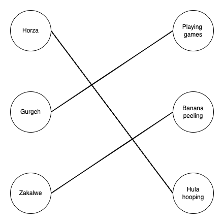

# Matching
Bipartite graph maximum matching algorithm implemented in Java. Treats the problem as a network flow problem and uses 
highly performant push-relabel maximum flow algorithm.

## Quick start

```xml
<dependency>
    <groupId>org.open-structures</groupId>
    <artifactId>matching</artifactId>
    <version>1.0.0</version>
</dependency>
```

Let's say we have people and tasks. For example:



The edge between nodes means that the person is qualified to do a specific task, e.g. Horza can play games and hula-hoop.
Here we assume that we only need one person for each task.
A matching would represent task assignments to different people. A maximum matching (maximum number of assignments) could look like this:



Horza is hula-hooping, Gurgeh – playing games, and Zakalwe will peel bananas.

Here's how it can be expressed in code. First we define a 'task qualifications' predicate – a function that returns true when a person can do a task:

    BiPredicate<String, String> qualificationsPredicate = (person, task) ->
                (person.equals("Horza") && (task.equals("playing games") || task.equals("hula hooping"))) ||
                        (person.equals("Gurgeh") && (task.equals("playing games") || task.equals("banana peeling"))) ||
                        (person.equals("Zakalwe") && task.equals("banana peeling"));


Next we create new `Matching` and find a maximum matching:

    Matching<String, String> matching = Matching.newMatching(qualificationsPredicate, newHashSet("Horza", "Gurgeh", "Zakalwe"), newHashSet("hula hooping", "playing games", "banana peeling"));
    matching.findMatching();

Now we get our task assignments: 

    Map<String, String> matches = matching.getMatches();
    matches.get("Horza"); // hula hooping
    matches.get("Gurgeh"); // playing games
    matches.get("Zakalwe"); // banana peeling
 